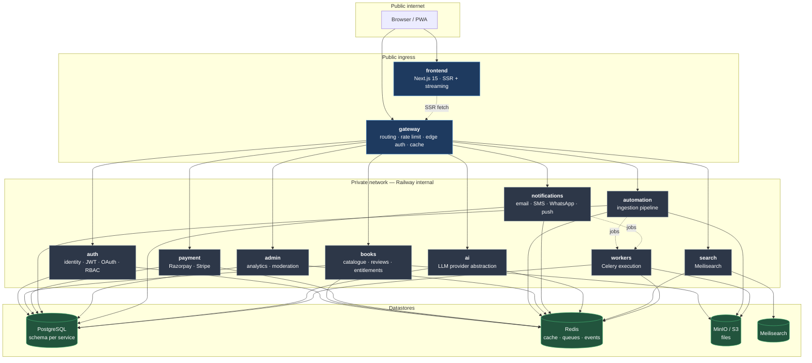
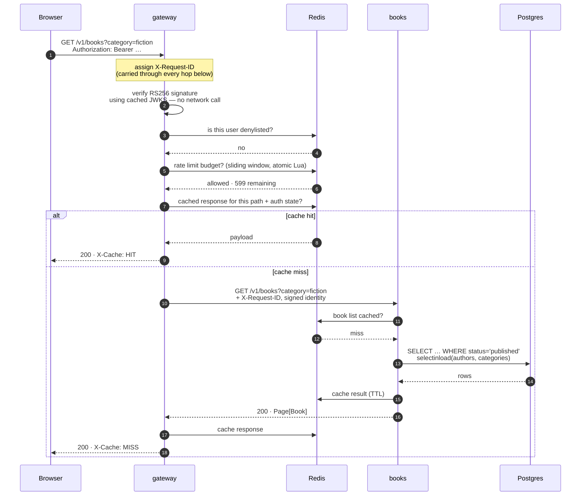
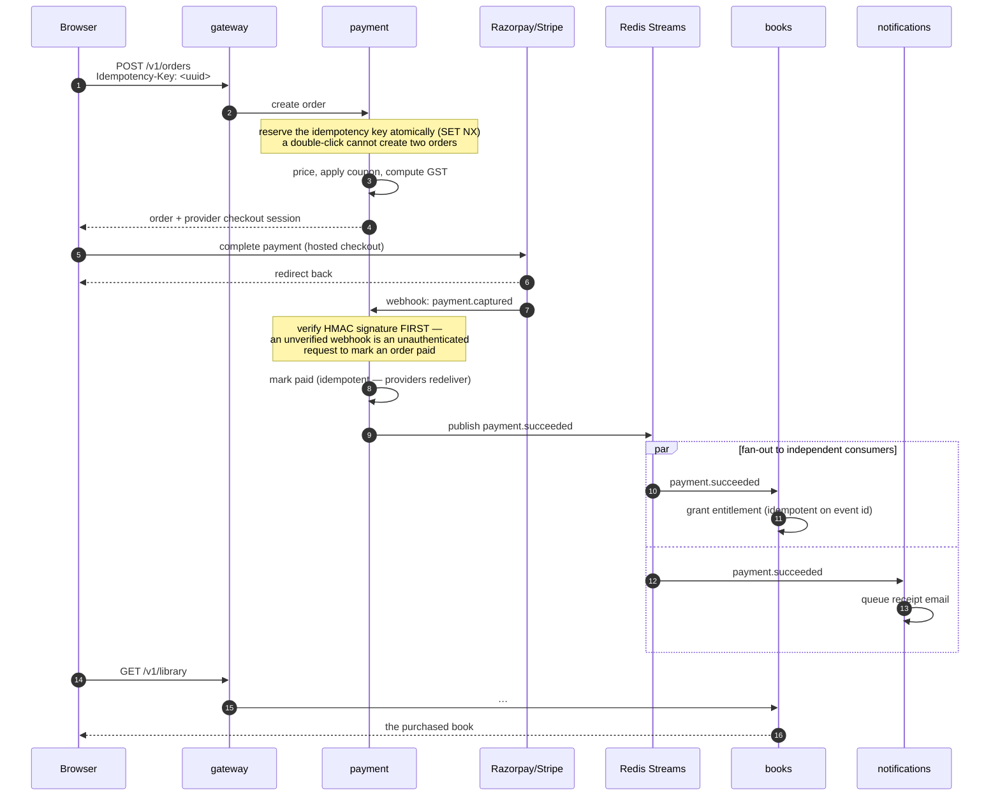
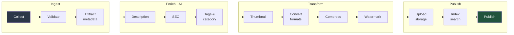
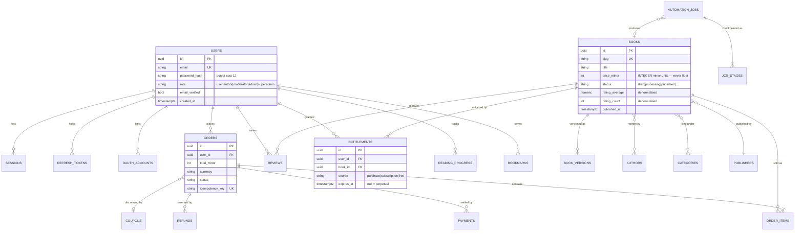

# Architecture

How KnowledgeOS is put together, and why. Decisions with real alternatives are
recorded in [`adr/`](adr/); this page describes the resulting system.

---

## 1. System overview



**Two communication patterns, and only two.**

*Synchronous HTTP* when a caller needs an answer to continue — the gateway asking
auth to validate, books asking payment about an order. These calls are HMAC-signed,
correlation-propagated and circuit-broken.

*Asynchronous events over Redis Streams* when a service needs to announce that
something happened — `payment.succeeded`, `book.published`. The publisher does not
know or care who listens, and a listener being down for a deploy loses nothing.

**The frontend never touches a database.** Every read goes through the gateway.

---

## 2. Request lifecycle

What happens on a single authenticated catalogue request:



Three things this diagram is making a point about:

- **Token verification costs no network call.** The gateway holds the JWKS in memory.
  Auth can be entirely down and existing sessions keep working.
- **The rate-limit check is one atomic Lua script**, not read-then-write. Two
  concurrent requests cannot both observe "one slot left" and both pass.
- **The cache key includes authentication state.** Serving an authenticated response
  from an anonymous key is a cross-user data leak, and it is an easy mistake to make.

---

## 3. Purchase flow

The path where correctness matters most, because money and access rights change:



**Why the entitlement is granted by an event rather than a direct call.** If payment
called books synchronously and books were mid-deploy, the call fails — and the
customer has paid for a book they cannot open. With an event, books consumes it
whenever it comes back up.

The cost is eventual consistency: there is a window, usually well under a second,
where payment has completed and the library has not updated. The UI shows pending
state rather than pretending otherwise.

**Every consumer must be idempotent.** Delivery is at-least-once — a redelivered
`payment.succeeded` must not grant a second entitlement or send a second receipt.

---

## 4. The automation pipeline

The most involved part of the platform. A book goes in; a fully-prepared,
searchable, published product comes out.



Each stage is a separate Celery task with its result checkpointed to the
`automation_jobs` table.

**Why checkpoint per stage.** Watermarking a 300-page PDF is minutes of CPU;
generating a description is an LLM call that may rate-limit. If stage 11 fails, the
retry resumes from stage 11 — it does not redo ten minutes of work and three dollars
of tokens. This is also what makes `acks_late=True` safe: a worker killed mid-deploy
has its task redelivered, and the pipeline resumes from the last completed stage
rather than duplicating side effects.

Failure handling:

- Transient failures retry with exponential backoff **and jitter**. Without jitter,
  500 jobs that failed together because a provider went down all retry at the same
  instant and knock it over again the moment it recovers.
- After the retry budget is exhausted, the job is dead-lettered with its full stage
  history, and an operator can replay it after a fix.
- AI stages are **skippable**: no provider configured, or the monthly budget is
  exhausted, means the book publishes with metadata-only rather than blocking.

---

## 5. Data model



Boundaries these tables live behind — see [ADR 0002](adr/0002-database-topology.md):

| Schema | Tables |
|---|---|
| `auth` | users, sessions, refresh_tokens, oauth_accounts, signing_keys, audit_logs |
| `books` | books, authors, categories, publishers, reviews, bookmarks, reading_progress, entitlements, book_versions |
| `payment` | orders, order_items, payments, refunds, coupons, subscriptions, invoices |
| `automation` | automation_jobs, job_stages, imports |
| `notifications` | notifications, templates, delivery_attempts |
| `ai` | ai_requests, usage_ledger |
| `admin` | analytics_snapshots, moderation_queue |

Three conventions applied throughout:

**Money is an integer of the currency's smallest unit.** `price_minor = 49900` is
₹499.00. Floats cannot represent 0.1 exactly; float money produces invoices that do
not reconcile, and the error compounds with every line item.

**UUIDv4 primary keys, generated in Python.** An object has identity before it is
flushed, so we can build URLs and publish events inside the transaction that creates
the row. (UUIDv7 is the upgrade path if insert throughput ever suffers from btree
fragmentation.)

**Soft deletes are explicit.** `deleted_at IS NULL` is written in each query rather
than applied by a global filter — an implicit filter is invisible at the call site,
and eventually someone writes the report that silently omits half the rows.

---

## 6. Security model

Defence in depth, layer by layer:

```
Browser ─── HTTPS, HSTS, strict CSP, SameSite cookies
   │
Gateway ─── rate limiting · JWT signature verification · ban denylist
   │        CORS allowlist · body size cap · hop-by-hop header stripping
   │
Service ─── RBAC + per-endpoint permissions · ownership from the token, never the body
   │        parameterised queries · content-based upload validation · idempotency
   │
Data ────── schema isolation · bcrypt(12) · hashed opaque tokens
            private-by-default storage · minutes-long signed URLs
```

Specific decisions worth stating plainly:

- **Only `auth` can mint a token.** RS256 means a compromise of any other service
  cannot forge credentials. See [ADR 0003](adr/0003-authentication.md).
- **Access tokens live in memory; refresh tokens in httpOnly cookies.** An XSS that
  reaches `localStorage` would otherwise obtain a 30-day credential.
- **Refresh rotation with reuse detection.** Presenting an already-consumed refresh
  token means it was stolen — the legitimate client and the attacker cannot both hold
  the current one — so the entire token family is revoked.
- **Private-network reachability is not authorisation.** `/internal/*` endpoints
  require an HMAC signature over method, path, body hash and timestamp. An SSRF bug
  in a public endpoint therefore cannot reach an internal one.
- **Webhook signatures are verified before the payload is read.** An unverified
  webhook is an unauthenticated request to mark an order paid.
- **Unhandled exceptions never reach the client.** They can carry connection strings,
  file paths and row contents; the client gets a generic 500 and the detail goes to
  the log with a request id.

---

## 7. Failure behaviour

What happens when each dependency fails — designed, not incidental:

| Failure | Behaviour |
|---|---|
| **auth is down** | Existing sessions keep working (offline JWT verification). New logins fail. Everything else is unaffected. |
| **Redis is down** | Rate limiting **fails open** — unlimited traffic is better than a total outage. Caches miss through to Postgres. Queued jobs wait. |
| **Postgres is down** | Reads served from cache while it lasts; writes fail with 503. `/health/ready` goes red and the instance drains. |
| **A single service is down** | The gateway returns 503 for that path only. Its circuit breaker opens so callers fail fast instead of exhausting connection pools. |
| **Meilisearch is down** | Search returns 503; browsing, buying and reading are unaffected. The index is rebuildable from Postgres. |
| **An AI provider is down** | The provider abstraction fails over to the next configured one. If all fail, automation publishes with metadata only. |
| **Object storage is down** | Marked **optional** in readiness — most endpoints do not touch it, so the service stays in rotation. Downloads and uploads fail. |
| **A worker dies mid-job** | `acks_late` redelivers the task; stage checkpointing resumes from the last completed stage. |

The unifying principle: **degrade a feature, never the platform.** A search outage
must not stop someone reading a book they already own.

---

## 8. Scaling path

Where the system is today and what changes at each order of magnitude:

**~1k users.** One replica per service. The defaults in this repository are sized for
this and need no tuning.

**~100k users.** Scale `gateway`, `books` and `frontend` horizontally — they are
stateless. Scale `workers` on **queue depth**, not CPU: a worker blocked on an LLM
response looks idle while the backlog grows. Add a Postgres read replica and route
`admin` analytics to it.

**~1M users.** Put a CDN in front of covers and thumbnails (they are already served
from a public prefix with immutable cache headers). Introduce pgbouncer in
transaction mode — `statement_cache_size=0` is already set, which is what makes that
safe with asyncpg. Consider splitting `payment` to its own database; because no
service reads another's schema, that is a `pg_dump` of one schema and a connection
string change, not a rewrite.

**Beyond.** The event bus is the next bottleneck: Redis Streams are single-node. The
`EventPublisher`/`EventConsumer` interface exists as the seam to swap in Kafka
without touching a single handler.

---

## Further reading

| | |
|---|---|
| [ADRs](adr/) | Decisions, alternatives rejected, consequences accepted |
| [Service authoring guide](SERVICE_AUTHORING_GUIDE.md) | The contract every service is built against |
| [Manual setup](MANUAL_SETUP.md) | Every value you must supply yourself |
| [Railway deployment](../infrastructure/railway/README.md) | Production topology and scaling |
